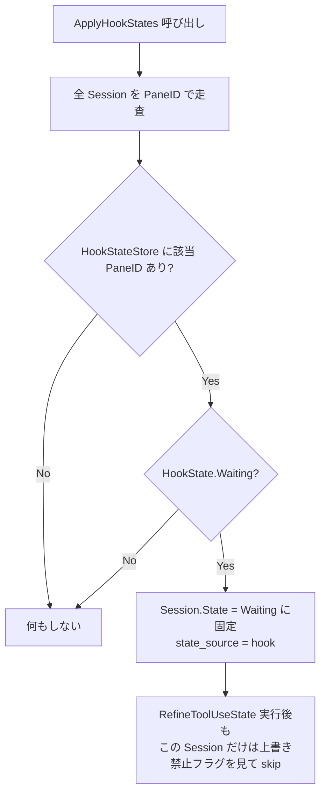

# Hook State Detection 詳細設計

## 概要

本設計は [ADR-0015](../../adr/0015-hook-based-waiting-detection.md) の実装仕様を定義する。Claude Code hooks を輸送路として、以下 2 点を baton の状態管理に統合する。

- `PermissionRequest` イベントによる `Waiting` 状態の確定（画面判定より優先）
- `session_id` / `transcript_path` の pane への紐付け（相関情報の保持）

**スコープ外**: working / idle の判定は本設計の対象外であり、引き続き `classifyClaudePane`（`state-manager.md` 参照）が権威を持つ。Codex / Gemini / WezTerm は対象外（Claude Code + tmux のみ）。

---

## 責務

1. `baton hook` サブコマンドが Claude Code hook の stdin JSON を受け取り、`pane_id` を添えて常駐 baton へ転送する
2. 常駐 baton が Unix domain socket でリッスンし、受信した hook イベントを pane 単位の hook 状態として保持する
3. `PermissionRequest` を受信した pane は `HookWaiting=true` とし、後続の解除イベントが来るまで維持する
4. `doScan` のスキャン結果へ hook 状態を適用し、`classifyClaudePane` の結果より優先させる
5. `session_id` / `transcript_path` を pane に紐付け、status JSON の `state_source` 判定と将来の resolver 1:1 化（Phase 4、別タスク）に使えるようにする

---

## コンポーネント構成

```
baton hook (CLIサブコマンド, 短命プロセス)
  → Unix domain socket (~/.local/state/baton/hook.sock)
    → 常駐 baton (HookServer)
       → HookStateStore (pane_id -> HookState)
          → StateManager.ApplyHookStates (doScan 内で呼び出し)
```

`HookServer` と `HookStateStore` は新規コンポーネントとして `internal/core` に追加する。`baton hook` サブコマンドは `main.go` に追加する。

---

## インターフェース

### `baton hook`（クライアント側）

| 項目 | 内容 |
|------|------|
| 入力 | stdin から Claude Code hook の JSON（1 件） |
| 付加情報 | 環境変数 `$TMUX_PANE` を読み取り `pane_id` として JSON に付加する |
| 送信先 | `hook.socket_path`（既定 `~/.local/state/baton/hook.sock`） |
| 送信形式 | 改行区切り JSON（1 行 1 イベント） |
| タイムアウト | 接続確立を含め 1 秒以内に完了しない場合は送信を諦める |
| 終了コード | 常に `0`（Claude Code をブロックしない） |

`baton hook` が exit 0 を返す（何もしない）ケース:

- `$TMUX_PANE` が未設定（tmux 外で実行された hook）
- socket ファイルが存在しない、または接続に失敗した（常駐 baton 未起動）
- config の `hook.enabled` が `false`

擬似コード:

```go
func runHookCommand(cfg Config) int {
    if !cfg.Hook.Enabled {
        return 0
    }
    paneID := os.Getenv("TMUX_PANE")
    if paneID == "" {
        return 0
    }
    payload, err := io.ReadAll(os.Stdin)
    if err != nil {
        return 0
    }
    conn, err := net.DialTimeout("unix", cfg.Hook.SocketPath, 1*time.Second)
    if err != nil {
        return 0 // 常駐未起動などは無視してよい
    }
    defer conn.Close()
    event := buildHookEvent(paneID, payload) // pane_id を注入
    conn.Write(append(event, '\n'))
    return 0
}
```

### `HookServer`（常駐側）

| 項目 | 内容 |
|------|------|
| リッスン | 常駐 baton プロセスのみ。`--exit` / `--once` 起動は listen しない |
| 権限 | socket ファイルは `0600` |
| stale socket | 起動時に既存ファイルへの接続を試み、失敗を確認してから削除して bind し直す（実行中インスタンスの socket を誤って奪わないため） |
| 受信処理 | 改行区切りで JSON をデコードし、`HookStateStore` に非同期で反映する |
| 即時再スキャン | `PermissionRequest` 受信時のみ、デバウンス付きで即時スキャンをトリガーする（解除イベントは次の tick まで待つ） |

### `HookStateStore`

```go
// HookState は 1 pane あたりの hook 由来の状態を表す。
type HookState struct {
    Waiting         bool
    SessionID       string
    TranscriptPath  string
    IdleScanStreak  int // classifyClaudePane が Idle を返した連続回数
}

type HookStateStore interface {
    Apply(event HookEvent)              // hook イベントを反映する
    Get(paneID string) (HookState, bool)
    NoteScanResult(paneID string, paneState SessionState) // 安全網のカウンタ更新用
    RemovePane(paneID string)           // ペイン消失時の掃除
}
```

---

## Hook イベントの解釈

### 対象イベント

登録する 7 イベントと baton 側の解釈（2 値のみ）。

| hook_event_name | baton の解釈 |
|-----------------|--------------|
| `PermissionRequest` | `Waiting` を確定（`agent_id` 有無に関わらず採用） |
| `PreToolUse` | 解除 |
| `PostToolUse` | 解除 |
| `Stop` | 解除 |
| `UserPromptSubmit` | 解除 |
| `SessionStart` | 解除 + `session_id` / `transcript_path` の記録 |
| `SessionEnd` | 解除 + `HookStateStore.RemovePane` |

herdr のような多段状態機械（working/blocked/idle の 3 値以上）は採用しない（ADR-0015 参照）。baton にとって hooks は「Waiting か、そうでないか」の 2 値情報でしかない。

### Waiting 解除の 3 条件

1. 上記「解除」に該当する後続 hook イベントの受信
2. 対象ペインが tmux スキャン結果から消えた（`HookStateStore.RemovePane` 相当）
3. `classifyClaudePane` が Idle を `hook.idle_cancel_scans`（既定 3）回連続で返した（安全網）

TTL は設けない。理由は ADR-0015 Rationale を参照（離席中の長時間承認待ちを誤って消さないため）。

---

## doScan への統合

### 注入点

`UpdateFromScan` と `RefineToolUseState` の間に `ApplyHookStates` を挿入する。呼び出し箇所は `main.go` の 2 箇所（`doScan` クロージャ、および 205 行付近の scan ループ）と `internal/tui/update.go` の tick 処理。

```go
doScan := func() error {
    result := scanner.Scan()
    if err := stateManager.UpdateFromScan(result); err != nil {
        return err
    }
    stateManager.ApplyHookStates(hookStore) // ← 新規注入点
    stateManager.RefineToolUseState(term)
    return nil
}
```

### `ApplyHookStates` の処理フロー



- `ApplyHookStates` は該当 pane の `Session.State` を `Waiting` に設定し、`state_source` を `hook` にマークする
- 直後に実行される `RefineToolUseState`（`classifyClaudePane` 呼び出し元）は、`state_source == hook` かつ `HookState.Waiting == true` の Session を上書きしない。ただし `classifyClaudePane` の判定結果自体は `HookStateStore.NoteScanResult` に渡し、Idle 連続カウント（安全網用）だけは進める

### 優先順位表

| 情報源 | 優先度 | 上書き条件 |
|--------|--------|-----------|
| hook (`PermissionRequest` による Waiting) | 最優先 | 解除 3 条件のいずれかが成立するまで維持 |
| ペインテキスト（`classifyClaudePane`） | hook Waiting が無い場合の権威 | 従来通り |
| JSONL（初期状態・降格フォールバック） | 上記 2 つが判定不能な場合のみ | 従来通り |

---

## session_id / transcript_path の紐付け

- `SessionStart` イベント受信時に `session_id` / `transcript_path` を `HookStateStore` へ記録する（herdr の現行設計と同じ用途）
- `PermissionRequest` にも `session_id` / `transcript_path` が含まれるため、`SessionStart` を経由していない場合でも取得できる
- 本設計では取得・保持のみを行い、resolver への活用（1:1 化）は Phase 4 の別タスクとする（下記「今後の拡張」参照）

---

## status JSON への反映

`/tmp/baton-status.json` の各セッション（`SessionOutput`）に以下を追加する。version は `2` のまま据え置き（フィールド追加のみ、既存フィールドは変更しない）。

| フィールド | 型 | 説明 |
|-----------|-----|------|
| `session_id` | string | hook 由来の Claude Code session ID（未取得時は省略） |
| `transcript_path` | string | hook 由来の JSONL パス（未取得時は省略） |
| `state_source` | string | `hook` / `pane` / `jsonl` のいずれか。状態の決定要因を示す |

`state_source` の決定順は「優先順位表」と同一（hook → pane → jsonl）。

---

## TUI への反映

右ペインに `source: hook` を 1 行表示する（hook Waiting が有効なセッションのみ）。これは hook 検知の検証期間中の可視化用であり、将来的に削除可能な暫定表示として扱う。

---

## 設定

`Config`（`internal/config/config.go`）に以下を追加する。

```yaml
log_file: ~/.local/state/baton/baton.log

hook:
  enabled: true
  socket_path: ~/.local/state/baton/hook.sock
  idle_cancel_scans: 3
```

| キー | 型 | 既定値 | 説明 |
|------|-----|--------|------|
| `log_file` | string | `~/.local/state/baton/baton.log` | デバッグログの出力先。証拠採取フェーズ（後述）で使用 |
| `hook.enabled` | bool | `true` | `false` で hook 連携を無効化し、`baton hook` は常に exit 0 を返す |
| `hook.socket_path` | string | `~/.local/state/baton/hook.sock` | Unix domain socket のパス |
| `hook.idle_cancel_scans` | int | `3` | Waiting 解除の安全網となる Idle 連続スキャン回数 |

---

## エラー処理方針

| エラー状況 | 対応 |
|-----------|------|
| socket 接続失敗（常駐 baton 未起動） | `baton hook` は何もせず exit 0（Claude Code をブロックしない） |
| stale socket ファイルが残存 | 常駐起動時に接続を試み、失敗を確認してから削除して bind し直す |
| hook JSON のパース失敗 | 当該イベントを破棄し、既存の `HookState` は変更しない |
| `TMUX_PANE` 未設定 | `baton hook` は exit 0（tmux 外実行、または hook 定義誤りとみなす） |
| 複数の常駐 baton が起動している | stale socket 判定（起動時に接続を試みる）により、既に生きている socket には後発インスタンスが接続に成功し「使用中」と判定するため削除・bind し直さない（先勝ち）。後発インスタンスは listen を諦め、pane スキャンのみで動作する |

---

## 設計判断の記録

### 1. hooks の役割を Waiting 確定 + 相関情報に限定する理由

**判断**: working / idle の判定には hooks を使わず、`classifyClaudePane` の権威性を維持する。

**理由**:
- herdr が「hooks で全状態報告」を一度採用し、`SubagentStop` 等の非決定的タイミングでの誤検知により放棄した実績がある（ADR-0015 参照）
- `PermissionRequest` は承認ダイアログ表示と同時に発火する数少ない決定的イベントであり、Waiting 確定という限定用途には適する
- 責務を絞ることで、baton 側の状態機械を herdr のような多段構成にせず「Waiting かどうかの 2 値」に単純化できる

### 2. TTL を設けない理由

**判断**: hook 由来の Waiting は明示的な解除イベントか安全網（Idle 連続スキャン）でのみ解除する。

**理由**:
- 承認待ちは人間の操作待ちであり、経過時間そのものには意味がない
- 離席中の数時間規模の承認待ちを TTL で誤って解除すると、hook 検知の意義（画面判定より確実な Waiting 検知）が損なわれる

### 3. Unix domain socket を輸送路に選んだ理由

**判断**: ペインごとの状態ファイル + fsnotify ではなく、socket によるプッシュ型輸送路を採用する。

**理由**:
- baton は常駐プロセスであることが前提であり、常駐中はリスナーを張り続けられる。socket はイベント到着と同時に処理でき、ポーリング/fsnotify のような遅延や取りこぼしのリスクがない
- 既存の `watcher.go`（fsnotify）は JSONL 監視専用の設計で、v2 移行時点で実質デッドコード化している（`state-manager.md` の「Watcher 依存を削除する理由」参照）。同じ仕組みを流用するのは設計上の逆行になる
- socket はファイルシステムへの書き込みを介さないため、状態ファイルの陳腐化・削除タイミングの競合を考えなくてよい

### 4. 常駐 baton のみが listen する理由

**判断**: `--exit` / `--once` 起動は hook 状態を保持せず、socket も listen しない。

**理由**:
- hook 由来の Waiting は「セッション横断で持続する状態」であり、単発実行のプロセスに保持させても次の実行までに失われ意味がない
- 複数プロセスが同一 socket を listen しようとすると bind の奪い合いが発生し、常駐プロセスの安定動作を損なう
- 前提として、baton は WezTerm 起動時に常駐起動されている運用を取っており、常駐 1 プロセスへの集約は既存運用と整合する

### 6. 自動承認モード（`checkAutoApprove`）はロジック変更不要な理由

**判断**: hook 由来の Waiting を導入しても `checkAutoApprove` 自体は変更しない。

**理由**:
- `checkAutoApprove` は PaneID をキーに Waiting への立ち上がりを検知して `Enter` を送信するだけであり、Waiting がどの情報源（hook / pane / jsonl）から確定したかを区別しない
- `ApplyHookStates` が `Session.State` を `Waiting` に設定するため、以降のフローは従来通り PaneID ベースの立ち上がり検知がそのまま機能する
- `PermissionRequest` の `tool_input` を自動承認のリスク判定に使う拡張は別タスク（下記「今後の拡張」参照）であり、本設計のスコープには含めない

### 5. 証拠採取フェーズを先に置く理由

**判断**: hook 実装（PR 2）の前に、ログ強化のみの PR 1 を挟む。

**理由**:
- 「承認待ちの検知が甘い」という不満はあるが、`classifyClaudePane` のどのパターンが取りこぼしているかの具体例が未記録
- `log_file` と debug ログ（降格分岐、判定不能時のペイン末尾 30 行）を先に導入し、実例を最低 1 件収集してから hook 実装に着手することで、実装が的外れになるリスクを下げる

---

## 今後の拡張（本設計のスコープ外）

| 拡張 | 内容 | 備考 |
|------|------|------|
| resolver の 1:1 化 | hook 由来の `transcript_path` を持つセッションは `ResolveMultiple` の CWD 束ねを経由せず、`resolveOneJSONL`（新設予定）で直接解決する | Phase 4 の別タスク。`state-resolver.md` の Ambiguous 判定を置き換える可能性がある |
| 自動承認モードでの `tool_input` 活用 | `PermissionRequest` の `tool_input` を自動承認の安全判定（ADR-0014）のリスク判定材料として使う | 別タスク。本設計では hook payload の保持のみ行い、判定ロジックには使わない |
| Codex / Gemini / WezTerm 対応 | 本設計は Claude Code + tmux のみが対象 | 別タスク |

---

## 実装ステップ（PR 分割）

| PR | 内容 |
|----|------|
| PR 1 | `log_file` 追加、降格分岐・`classifyClaudePane` 判定不能時の debug ログ追加（`log_level: debug` 限定。内容は pane ID・JSONL 状態・ペイン末尾 30 行）。取りこぼし例を Notion タスクに 1 件以上記録（目安 1 週間） |
| PR 2 | `baton hook` サブコマンド、`HookServer` / `HookStateStore`、`ApplyHookStates` 注入、`session_id` / `transcript_path` 保持、status JSON 拡張、TUI 表示。README の `Hook-free status` 記述を「hooks はオプション。承認待ちの精度向上に使い、未設定なら従来の画面判定で動く」に改訂 |
| PR 3 | dotfiles 側: 薄いラッパー `~/.claude/hooks/baton-hook.sh`（`command -v baton` が見つからない場合は exit 0）を追加し、`claude/settings.json` / `claude-work/settings.json`（nix 管理の実ファイル。直接編集禁止）に hook 定義を登録する |
| PR 4 | resolver の 1:1 化（上記「今後の拡張」参照） |

---

## 依存コンポーネント

| コンポーネント | 役割 |
|-------------|------|
| `internal/core/state.go` (`StateManager`) | `ApplyHookStates` の呼び出し元。Session への反映 |
| `internal/hook`（`Server` / `Store`） | socket リッスン、hook 状態の保持 |
| `main.go` | `baton hook` サブコマンド追加、常駐起動時の `HookServer` 起動 |
| `internal/config` (`Config.Hook`) | `hook.enabled` / `hook.socket_path` / `hook.idle_cancel_scans` |
| dotfiles（別リポジトリ） | `~/.claude/hooks/baton-hook.sh`（`command -v baton` 不在なら exit 0 の薄いラッパー）、`claude/settings.json` / `claude-work/settings.json`（nix 管理の実ファイル。直接編集禁止）への hook 登録 |
