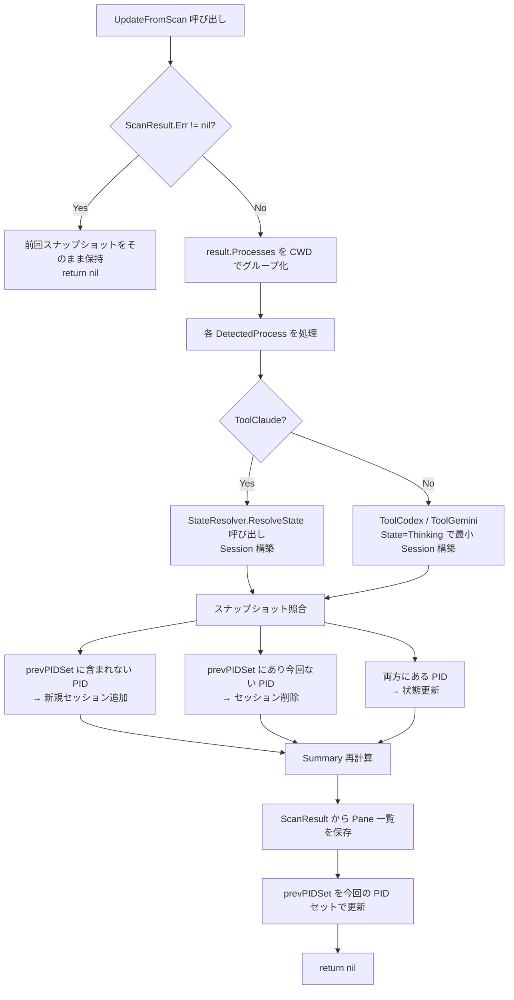

# StateManager 詳細設計

## 概要

`StateManager` は baton v2 において、検出されたプロセス情報（`ScanResult`）をプロジェクト・セッション単位に集約し、TUI や JSON エクスポーターへ最新状態を提供するコンポーネントである。

v1 では fsnotify イベントを起点としたイベント駆動方式を採用していたが、v2 では **ポーリング + スナップショット照合方式** へ全面改修する。本ドキュメントはその設計判断と実装仕様を記述する。

---

## v1 の設計と課題

### v1 の構造

```go
type StateManager struct {
    watcher           *Watcher
    incrementalReader *IncrementalReader
    projects          map[string]*Project
    mu                sync.RWMutex
}
```

- **Watcher 依存**: fsnotify イベントをトリガーに動作する
- **HandleEvent(WatchEvent)**: Created / Modified / Removed イベントを受け取り状態を更新する
- **upsertFromFile**: JSONL ファイルを `IncrementalReader` で読み込み、セッション状態を更新する
- **InitialScan()**: 起動時に全 JSONL ファイルをスキャンして初期状態を構築する
- **removeSession**: Watcher の Removed イベントに依存してセッションを手動削除する
- **GetProjects()**: `map[string]*Project` から配列コピーを生成し、Session.ID 昇順 → Project.Path 昇順でソートして返す
- **GetStatus()**: `StatusOutput`（プロジェクト一覧 + 更新時刻）を返す

### v1 の課題

| 課題 | 詳細 |
|------|------|
| イベントロスト | macOS の kqueue 制限により fsnotify イベントが欠落することがある |
| 競合状態 | Removed イベントとファイル読み込みが競合し、不整合な状態になりえる |
| Watcher 障害時の陳腐化 | Watcher が失敗した場合、状態がそのまま固着する |
| セッション削除の不確実性 | ファイル削除 != プロセス終了であり、プロセスが残っているのにセッションが消えるケースが生じる |

---

## v2 設計方針

### 方針の転換

| 観点 | v1 | v2 |
|------|----|----|
| 駆動方式 | fsnotify イベント駆動 | ポーリング + スナップショット照合 |
| 真実の源泉（Source of Truth） | JSONL ファイルの存在 | OS プロセスの存在 |
| Watcher 依存 | あり | **完全に削除** |

v2 では「プロセスが存在する = セッションが存在する」を基本原則とし、OS プロセスのライフサイクルを直接監視する。

### 依存グラフ

```
StateManager
  └── StateResolver  (JSONL 解析 + 状態判定)
        └── Parser   (IncrementalReader)
```

`StateManager` は `Watcher` および `IncrementalReader` を**直接保持しない**。ファイル I/O は `StateResolver` に委譲し、`StateManager` は状態集約に専念する（関心の分離）。

---

## インターフェース定義

v2 では StateManager の責務を読み取りと更新に明確に分離し、それぞれをインターフェースで表現する。

```go
// StateUpdater はスキャン結果による状態更新を定義する。
type StateUpdater interface {
    UpdateFromScan(result ScanResult) error
}

// StateReader は集約済み状態への読み取り専用アクセスを定義する。
type StateReader interface {
    Projects() []Project
    Summary() Summary
    Panes() []Pane
}
```

`StateManager` は `StateUpdater` と `StateReader` の**両方を実装**する。

- `UpdateFromScan` はポーラー（`Scanner`）がスキャン後に呼び出す
- `Projects()`, `Summary()`, `Panes()` は TUI や `Exporter` が参照する

---

## 内部状態

```go
type StateManager struct {
    resolver   *StateResolver   // JSONL 解析・状態判定の委譲先
    projects   []Project        // 最新プロジェクト一覧スナップショット
    summary    Summary          // 最新集計（Active 数 / ByTool 等）
    panes      []Pane           // 最新ペイン一覧（Ambiguous セッション解決用）
    prevPIDSet map[int]bool     // 前回スキャンの PID セット（差分検出用）
    mu         sync.RWMutex    // 読み書き保護
}
```

### 各フィールドの役割

| フィールド | 型 | 役割 |
|-----------|-----|------|
| `resolver` | `*StateResolver` | JSONL 解析と状態判定をカプセル化する。ファイル I/O の詳細を隠蔽する |
| `projects` | `[]Project` | 最新スキャン時点のプロジェクト一覧。スライス形式で保持し、ソート済みで返す |
| `summary` | `Summary` | セッション数・ツール別内訳などの集計値。都度再計算してキャッシュする |
| `panes` | `[]Pane` | ターミナルが返したペイン情報（PaneID + TTY）。Ambiguous セッション表示に使用 |
| `prevPIDSet` | `map[int]bool` | 前回スキャンの PID セット。今回との差分でセッションの追加/削除を判定する |
| `mu` | `sync.RWMutex` | 書き込み（UpdateFromScan）と読み取り（Projects 等）を並行安全にする |

---

## UpdateFromScan 処理フロー

### フローチャート



### ステップ詳細

**Step 1: エラーチェック**

```go
if result.Err != nil {
    // 前回スナップショットを保持（Watcher 障害時と同様の fail-safe 動作）
    return nil
}
```

過渡的なエラー（権限エラー、FS 一時障害）でも表示が崩れないよう、前回の状態を維持する。

**Step 2: ワークスペース優先グループ化**

`result.Processes` の各 `DetectedProcess` を以下のルールでグループ化し、プロジェクト単位に分類する。

1. `ScanResult.Panes` から PaneID → Workspace のマッピングを構築する
2. 各 `DetectedProcess` の PaneID を使って Workspace を解決する
3. Workspace が空でなく `"default"` でもない場合 → Workspace でグルーピング
4. それ以外 → CWD でグルーピング（既存の動作）

```go
type projectKey struct {
    Workspace string // 空の場合は CWD ベース
    CWD       string // Workspace が空の場合のフォールバック
}

func resolveProjectKey(proc DetectedProcess, paneWorkspaceMap map[int]string) projectKey {
    ws := paneWorkspaceMap[proc.PaneID]
    if ws != "" && ws != "default" {
        return projectKey{Workspace: ws}
    }
    return projectKey{CWD: proc.CWD}
}
```

Workspace でグルーピングされたプロジェクトの `Name` にはワークスペース名を設定する。CWD フォールバック時は CWD のベース名を使用する（v2 既存の動作）。

**Step 3: セッション構築**

```go
for _, proc := range result.Processes {
    switch proc.ToolType {
    case ToolClaude:
        state, err := s.resolver.ResolveState(proc)
        // エラー時は Thinking にフォールバック
        session = buildSession(proc, state)
    case ToolCodex, ToolGemini:
        session = buildSession(proc, Thinking)
    }
}
```

`ToolCodex` / `ToolGemini` は JSONL を持たないため、State を `Thinking` とした最小構成のセッションを構築する。

**Step 4: スナップショット照合**

```go
currentPIDSet := buildPIDSet(result.Processes)

// 削除: 前回あって今回ない PID
for pid := range s.prevPIDSet {
    if !currentPIDSet[pid] {
        removeSession(pid)
    }
}

// 追加 / 更新
for pid := range currentPIDSet {
    if !s.prevPIDSet[pid] {
        addSession(pid)   // 新規
    } else {
        updateSession(pid) // 既存
    }
}
```

**Step 5: Summary 再計算**

全セッションを走査して集計値を更新する。

**Step 6: Pane 一覧保存 + prevPIDSet 更新**

`ScanResult.Panes`（DefaultScanner が `Terminal.ListPanes()` から取得したペイン一覧）を `s.panes` に保存し、`s.prevPIDSet` を今回の PID セットで置き換える。

---

## スナップショット照合の詳細

### PID による識別

v2 ではセッション識別子を v1 の `UUID（Session.ID）` から **PID（プロセス ID）** に変更する。

```
v1: Session.ID = "abc123-def456-..."  (JSONL パース時に生成した UUID)
v2: SessionKey = 12345                (OS が割り当てた PID)
```

### 照合アルゴリズム

```go
// O(N) のセット演算
prevSet := s.prevPIDSet          // map[int]bool
currSet := buildPIDSet(procs)    // map[int]bool

for pid := range prevSet {
    if !currSet[pid] { /* 終了 */ }
}
for pid := range currSet {
    if !prevSet[pid] { /* 新規 */ }
}
```

`map[int]bool` によるセット交差は O(N) で完結し、イベントキューや状態機械を必要としない。

### v1 との比較

| 方式 | 削除トリガー | 信頼性 |
|------|-------------|--------|
| v1（Remove イベント） | fsnotify Removed イベント | イベントロストで削除漏れが発生 |
| v2（PID 照合） | 次回ポーリング時に PID 消失を検出 | 自己修復型（ポーリングを外れても次回で整合） |

---

## Projects() のソート規則

### v1

```
Session.ID 昇順（UUID の辞書順）
Project.Path 昇順
```

### v2

```
状態優先度（降順）: Waiting > Error > Thinking > ToolUse > Idle
同一状態内: LastActivity 降順（直近アクティブなセッションを上位に）
```

### 変更の理由

TUI での視認性向上のため、緊急度の高い状態（`Waiting`：ユーザー入力待ち）を先頭に表示する。v1 の UUID 昇順は表示順に意味がなく、アクティブなセッションが末尾に埋もれることがあった。

---

## Summary 計算

```go
type Summary struct {
    TotalSessions int
    Active        int
    Waiting       int
    ByTool        map[string]int
}
```

```go
func calcSummary(sessions []Session) Summary {
    s := Summary{
        TotalSessions: len(sessions),
        ByTool:        make(map[string]int),
    }
    for _, sess := range sessions {
        switch sess.State {
        case Thinking, ToolUse, Waiting:
            s.Active++
        }
        if sess.State == Waiting {
            s.Waiting++
        }
        s.ByTool[sess.Tool.String()]++
    }
    return s
}
```

| フィールド | 計算式 |
|-----------|--------|
| `TotalSessions` | 全セッション数 |
| `Active` | `Thinking + ToolUse + Waiting` の合計 |
| `Waiting` | `Waiting` 状態のセッション数 |
| `ByTool` | `{"claude": N, "codex": M, "gemini": K, ...}` |

---

## Panes() の用途

`Panes()` は TUI のサブメニューで使用する。

```
Ambiguous セッション: 同一プロセスに複数のペインが対応している場合
→ Pane 一覧（PaneID + TTY）をユーザーに提示して選択させる
```

`StateManager` は `ScanResult` から受け取ったペイン情報をキャッシュし、TUI が `Panes()` を呼び出した際に返す。ペイン情報の解決ロジックはターミナル層（`Terminal` インターフェース実装）が担う。

---

## エラー処理

### シナリオ 1: ScanResult.Err が非 nil

```go
func (s *StateManager) UpdateFromScan(result ScanResult) error {
    s.mu.Lock()
    defer s.mu.Unlock()

    if result.Err != nil {
        // 前回スナップショットをそのまま保持して正常リターン
        return nil
    }
    // ...
}
```

- **挙動**: 前回のスナップショットを維持し続ける（表示は古い状態を継続）
- **理由**: 過渡的なエラーで画面が空白になることを防ぐ（フェイルセーフ UI）

### シナリオ 2: StateResolver のエラー

```go
state, err := s.resolver.ResolveState(proc)
if err != nil {
    log.Printf("StateResolver error for PID %d: %v", proc.PID, err)
    state = Thinking // フォールバック
}
```

- **挙動**: 当該セッションを `Thinking` 状態にフォールバックし、処理を継続する
- **理由**: 1 セッションの解析失敗で他のセッション表示を止めない

---

## スレッド安全性

```go
// 書き込み: UpdateFromScan
func (s *StateManager) UpdateFromScan(result ScanResult) error {
    s.mu.Lock()
    defer s.mu.Unlock()
    // ...
}

// 読み取り: Projects, Summary, Panes
func (s *StateManager) Projects() []Project {
    s.mu.RLock()
    defer s.mu.RUnlock()
    // ...
}
```

### RWMutex を選択した理由

baton の読み書き比率は**読み取りが圧倒的に多い**。

- **書き込み頻度**: ポーリング間隔（例: 1〜5 秒に 1 回）
- **読み取り頻度**: TUI リフレッシュ（例: 60fps = 秒間 60 回）

`sync.Mutex`（排他ロック）では TUI の描画がポーリング完了まで待機する。`sync.RWMutex` を使用することで、読み取りを並行実行でき、TUI の応答性を維持できる。

---

## 設計判断の記録

### 1. Watcher 依存を削除する理由

**判断**: fsnotify Watcher を完全に排除し、ポーリング + スナップショット照合に移行する。

**理由**:
- プロセスの終了は「JSONL ファイルの削除」ではなく「OS プロセスの消滅」によって定義されるべきである
- macOS の kqueue は監視ディスクリプタ数の上限があり、多数のセッションを同時監視するとイベントが欠落する
- ポーリング方式は「ポーリングを1回外れても次回で正しい状態に戻る」自己修復性を持つ
- イベント駆動より予測可能でデバッグしやすい

### 2. PID をセッション識別子にする理由

**判断**: v1 の `Session.ID`（UUID）から PID（プロセス ID）に変更する。

**理由**:
- PID は OS が割り当てる値であり、実行中のプロセスにおいてシステム全体で一意である
- PID の消滅がそのままセッション終了を意味するため、UUID と実プロセスの紐付けテーブルが不要になる
- v1 の UUID は JSONL パース時に生成されるため、プロセスの実際のライフサイクルと乖離が生じる場合があった（例: JSONL が先に生成されるが、プロセスはまだ存在する）

### 3. エラー時に前回スナップショットを保持する理由

**判断**: `ScanResult.Err` が非 nil の場合、状態を更新せず前回のスナップショットを維持する。

**理由**:
- ディスクの一時的な権限エラーや FS の瞬断は、実際のセッション状態の変化を意味しない
- 空白画面や誤った「セッション 0」表示はユーザーの混乱を招く
- 「やや古い情報を表示する」方が「何も表示しない」より常にユーザーにとって有益である（フェイルセーフ UI 原則）

### 4. prevPIDSet による差分検出の簡潔さ

**判断**: `map[int]bool` のセット演算で差分を検出する。

**理由**:
- O(N) の 2 回ループ（旧→消滅チェック、新→追加チェック）で完結し、複雑な状態機械が不要
- イベントキューと異なり、ポーリングを外れた（スキップした）場合でも次回スキャン時に自動的に整合する
- Go の `map` は存在確認が O(1) であり、セッション数が増えても性能劣化が小さい

### 5. IncrementalReader を直接保持せず StateResolver 経由にする理由

**判断**: `StateManager` は `IncrementalReader` を直接保持せず、`StateResolver` に委譲する。

**理由**:
- `StateManager` の責務は「スキャン結果を集約してプロジェクト/セッション単位に整理すること」であり、「JSONL ファイルを読むこと」ではない
- `StateResolver` が「JSONL 解析 + 状態判定」を一体のユニットとしてカプセル化することで、ファイル I/O の詳細が `StateManager` に漏れない
- ユニットテストで `StateResolver` をモックすれば、`StateManager` のテストにファイルシステムが不要になる

---

## v1 との比較表

| 観点 | v1 | v2 |
|------|----|----|
| **イベント駆動源** | fsnotify（kqueue/inotify） | ポーリング（定期スキャン） |
| **セッション識別子** | UUID（JSONL パース時に生成） | PID（OS 割り当て） |
| **セッション削除トリガー** | Watcher Removed イベント（ファイル削除） | 次回スキャンで PID が消滅したことを検出（プロセス終了） |
| **エラー時の挙動** | Watcher 障害時は状態が固着・陳腐化 | 前回スナップショットを保持（フェイルセーフ） |
| **ソート順** | Session.ID 昇順 → Project.Path 昇順 | 状態優先度順（Waiting > Error > Thinking > ToolUse > Idle）→ LastActivity 降順 |
| **Watcher 依存** | あり（`*Watcher` を直接保持） | **なし**（完全に削除） |
| **IncrementalReader の保持** | StateManager が直接保持 | StateResolver 経由（StateManager は保持しない） |
